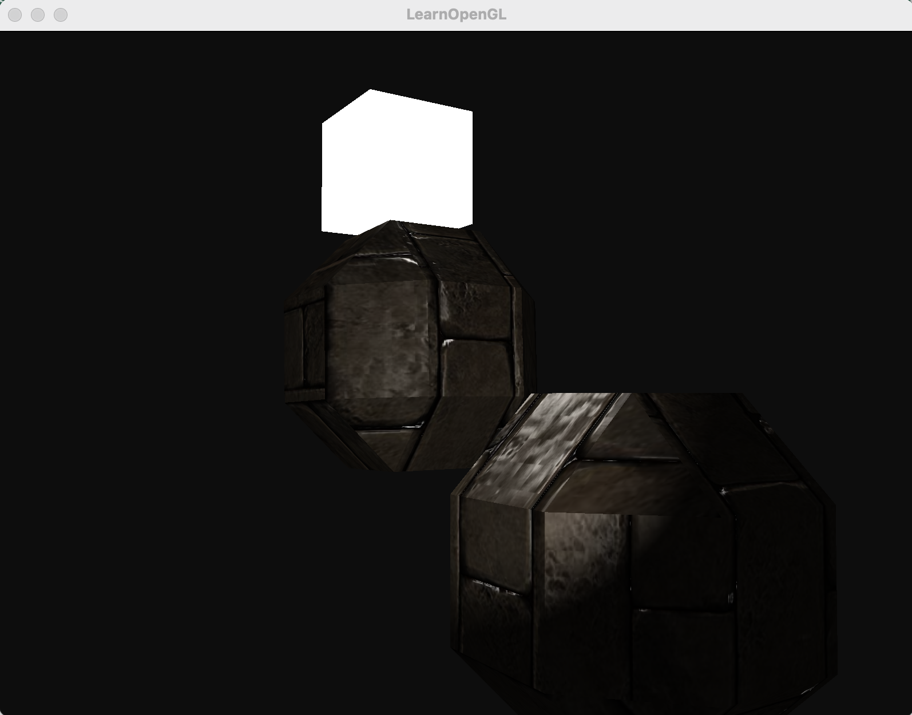
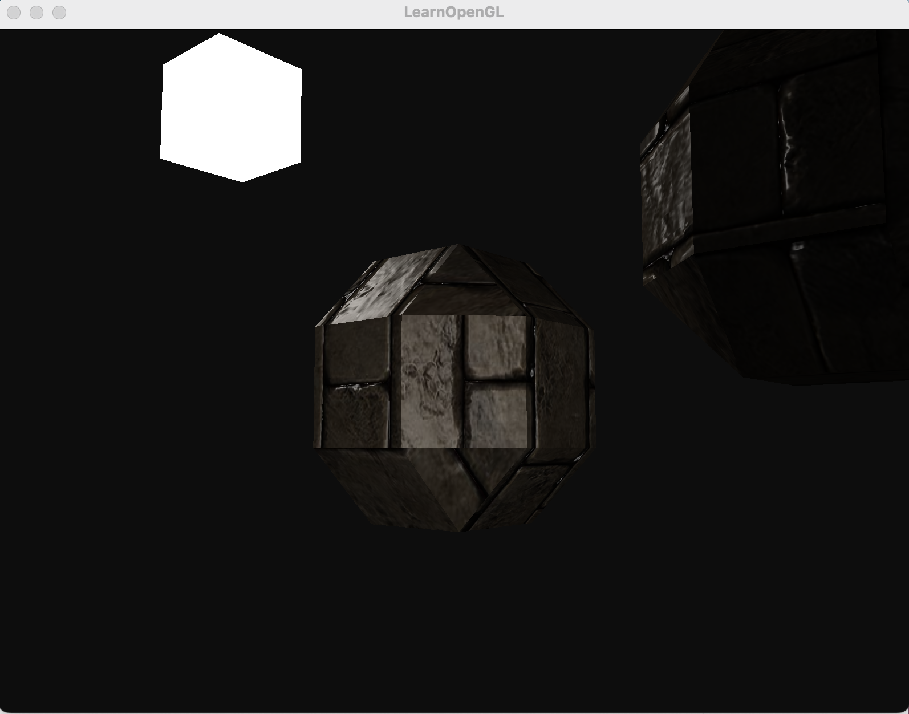

# ALGO: 华中科技大学计算机图形学作业（独孤信印章）

作业的思路和代码主要来自[learnopengl](https://learnopengl.com)，模型用blender制作，模型的加载参考https://learnopengl.com/Model-Loading/Assimp，光照参考https://learnopengl.com/Lighting，所谓的“凹凸纹理”参考https://learnopengl.com/Advanced-Lighting/Normal-Mapping，用blender做好的模型和纹理以及法线贴图放在res文件夹下，欢迎自行使用。

> 理论上本项目可以在多平台上构建。经过测试的平台有windows+VS2022，windows+mingw8.1.0，macos+xcode14.0。注意依赖库assimp在VS2022下**Debug配置**编译时会缺少pdb文件，暂时没有解决方案，请使用**Release配置**进行构建。
>
> 提供windows下的预编译二进制文件。
>

## 1. 安装依赖库 (可选)

本项目依赖glfw3，assimp和glm。可以使用包管理工具进行安装，跳过此步骤会自动从拉取github仓库从源码进行构建。

Macos下，使用homebrew安装。

```
brew install glfw
brew install assimp
brew install glm
```

Linux下可用自带包管理器安装（以apt为例），[可以参考这个文档](https://en.wikibooks.org/wiki/OpenGL_Programming/Installation/Linux)。

```
#install glfw

sudo apt-get install build-essential

sudo apt-get install build-essential libgl1-mesa-dev

sudo apt-get install libglew-dev libsdl2-dev libsdl2-image-dev libglm-dev libfreetype6-dev

sudo apt-get install libglfw3-dev libglfw3

#install assimp

sudo apt-get install libassimp-dev

sudo apt-get install libassipm3

sudo apt-egt install assimp-utils

#install glm

sudo apt install libglm-dev
```

## 2. 项目构建

使用cmake进行项目构建和安装。

```
cmake -B build -G <your_generator>

cmake --build build [--config=Release]

cmake --install build --prefix=<path/to/where/you/want/to/install/algo> [--config=Release]
```

## 3. 项目运行

​	可执行文件位于上述构建路径中的	`<path/to/where/you/want/to/install/algo/bin>`下，直接运行即可。

​	项目渲染两个印章，包含一个点光源和跟随视角移动的手电筒。按键WASD可在场景中移动，U和J可以控制模型外接球半径，H和K可以控制小模型旋转速度，N和M可以调整模型自转的速度。视角可随鼠标移动转动，使用鼠标滚轮可以放大和缩小视角。本项目实现了带衰减的phong shading和基于法线贴图的凹凸纹理。运行截图如下。




